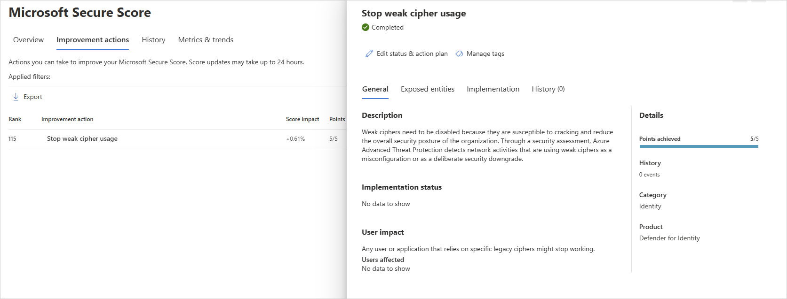

# Security assessment: Weak cipher usage

## What are weak ciphers?

Cryptography relies on ciphers to encrypt our data. For example, RC4 (Rivest Cipher 4 also known as ARC4 or ARCFOUR meaning Alleged RC4) is one. While RC4 is remarkable for its simplicity and speed, multiple vulnerabilities have been discovered since the original release of RC4, rendering it insecure. RC4 is especially vulnerable when the beginning of the output key stream isn't discarded, or when non-random or related keys are used.

## How do I use this security assessment to improve my organizational security posture?

1. Review the recommended action at <https://security.microsoft.com/securescore?viewid=actions> for weak cipher usage.

    
1. Research why the identified clients and servers are using weak ciphers.
1. Remediate the issues and disable use of RC4 and/or other weak ciphers (such as DES/3DES).
1. To learn more about disabling RC4, see the [Microsoft Security Advisory](https://support.microsoft.com/help/2868725/microsoft-security-advisory-update-for-disabling-rc4).

> [!NOTE]
> This assessment is updated in near real time.
> The reports show the affected entities from the last 30 days. After that time, entities no longer affected will be removed from the exposed entities list.

## Remediation

Make sure to test the following settings in a controlled environment before enabling them in production.

To remediate weak cipher usage, modify the msDS-SupportedEncryptionTypes AD attribute on the applicable devices and accounts, and remove the weak ciphers based on [these bit flags](/openspecs/windows_protocols/ms-kile/6cfc7b50-11ed-4b4d-846d-6f08f0812919).

After ensuring that devices and accounts are no longer using the weak ciphers, then modify the domain controller security policy to drop the weak ciphers from the [Network security: Configure encryption types allowed for Kerberos](/windows/security/threat-protection/security-policy-settings/network-security-configure-encryption-types-allowed-for-kerberos) setting.

> [!NOTE]
> While assessments are updated in near real time, scores and statuses are updated every 24 hours.  While the list of impacted entities is updated within a few minutes of your implementing the recommendations, the status may still take time until it's marked as **Completed**.
> 

## Next steps

- [Learn more about Microsoft Secure Score](/microsoft-365/security/defender/microsoft-secure-score)
- [How to disable RC4 - Tech Community blog post](https://techcommunity.microsoft.com/t5/core-infrastructure-and-security/decrypting-the-selection-of-supported-kerberos-encryption-types/ba-p/1628797)
- [Check out the Defender for Identity forum!](<https://aka.ms/MDIcommunity>)
